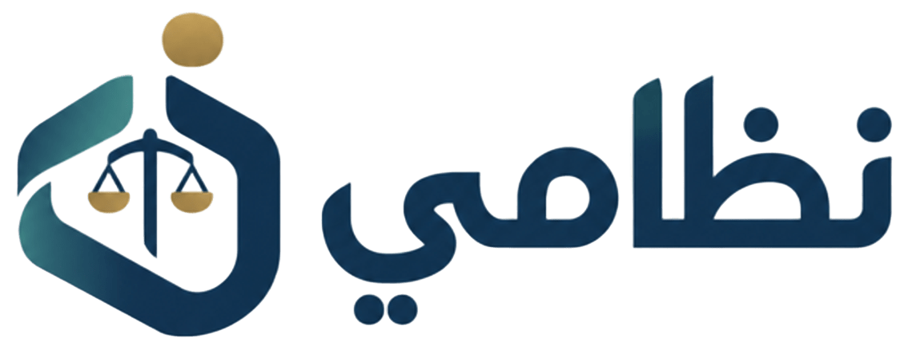

  

# Nizami — Saudi Labor Law RAG Assistant

An AI-powered legal assistant designed to help users query and understand the Saudi Labor Law using Retrieval-Augmented Generation (RAG), Hybrid Search, Cross-Encoder Reranking, and Gemini AI.

## Overview

Nizami reimagines legal information access by combining Large Language Models with reliable retrieval techniques. The system retrieves relevant articles from the Saudi Labor Law database, ranks them based on semantic relevance, and generates accurate answers grounded only in retrieved legal texts.

The goal is to provide a reliable assistant that helps users find information related to employment rights, contracts, leaves, wages, termination, and other Saudi Labor Law topics.

## Features

- AI-powered Saudi Labor Law assistant
- Retrieval-Augmented Generation (RAG) architecture
- Hybrid Search combining:
  - Dense Vector Search
  - BM25 Keyword Search
- Cross-Encoder Reranking for improved document selection
- Gemini LLM integration with fallback models
- Context-grounded answers to reduce hallucination
- Article and chapter references in responses
- Arabic language support
- REST API deployment

## Architecture

The system follows an end-to-end RAG pipeline:

1. User submits a legal question.
2. Query is processed through Hybrid Search to retrieve relevant legal articles.
3. Retrieved documents are reranked using a Cross-Encoder model.
4. Selected context is provided to Gemini LLM.
5. The model generates an answer based only on the retrieved legal content.

## Tech Stack

- **LLM:** Google Gemini API
- **Framework:** Retrieval-Augmented Generation (RAG)
- **Retrieval:**
  - ChromaDB
  - BM25
  - Hybrid Search
- **Reranking:** BAAI/bge-reranker-v2-m3
- **Backend:** Python API
- **Embeddings:** Sentence Transformers
- **Deployment:** Google Colab / API Server

## Evaluation Metrics

The system was evaluated using RAG evaluation metrics:

| Metric | Score |
|---|---:|
| Faithfulness | 97.1% |
| Answer Relevance | 100% |
| Context Precision | 97.1% |

These results demonstrate the ability of the system to generate relevant answers while maintaining strong grounding in retrieved legal documents.

## How It Works

1. Legal documents are processed and stored in a vector database.
2. User questions are searched using Hybrid Search to combine keyword and semantic retrieval.
3. Retrieved documents are reordered using Cross-Encoder Reranking.
4. Gemini generates a final response using only the retrieved legal context.
5. The API returns the answer with supporting legal sources.

## Author

**Leen Alsahli**

🔗 [LinkedIn](https://linkedin.com/in/leen-alsahli-1064a6305)  
🌐 [Portfolio](https://leen-portfolio-inky.vercel.app)
